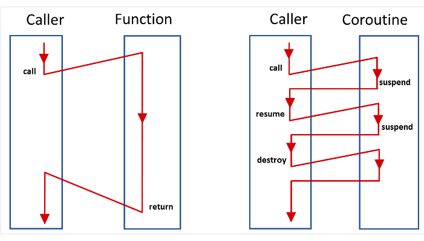

# 코루틴과 Async/Await

## 코루틴이란?
> 코루틴은 컴퓨터 프로그램 구성 요소 중 하나로 비선점형 멀티태스킹(non-preemptive multitasking)을 수행하는 일반화한 서브루틴(subroutine)이다. 코루틴은 실행을 일시 중단(suspend)하고 재개(resume)할 수 있는 여러 진입 지점(entry point)을 허용한다.

여러 명령어를 모아 이름을 부여해서 반복 호출할 수 있게 정의한 프로그램 구성 요소 == 함수
객체지향언어에서는 메소드도 서브루틴이라 할 수 있다.
어떤 서브루틴에 진입하는 방법은 오직 한 가지(해당 함수를 호출하면 서브루틴의 맨 처음부터 실행이 시작된다)뿐이며
그 때마다 활성 레코드(activation record)라는 것이 스택에 할당되면서 서브루틴 내부의 로컬 변수 등이 초기화된다
서브루틴 안에서 여러 번 return을 활용할 수 있기 때문에 서브루틴이 실행을 중단하고 제어를 호출한 쪽에게 돌려주는 지점은 여럿 있을 수 있다.
서브루틴에서 반환되고 나면 활성 레코드가 스택에서 사라지기 때문에 실행 중이던 모든 상태를 잃어버린다. 
그래서 서브루틴을 여러 번 반복 실행해도(전역 변수나 다른 부수 효과가 있지 않는 한) 항상 같은 결과를 반복해서 얻게 된다.

멀티태스킹은 여러 작업을 동시에 수행하는 것처럼 보이거나 실제로 동시에 수행하는 것

**코루틴이란 서로 협력해서 실행을 주고받으면서 작동하는 여러 서브루틴을 말한다**



코루틴 장점은 일반적인 프로그램 로직을 기술하듯 코드를 작성하고 상대편 코루틴에 데이터를 넘겨야 하는 부분에서만 yield를 사용하면 된다

## E.2 코틀린의 코루틴 지원: 일반적인 코루틴
코루틴은 특정 코루틴을 언어가 지원하는 형태가 아니라 코루틴을 구현할 수 있는 기본 도구를 언어가 제공하는 형태다.
`kotlinx.coroutines` 패키지 밑에 코틀린이 지원하는 기본 기능을 활용해 만든 다양한 형태의 코루틴들이 있다.

### E.2.1 여러 가지 코루틴
코틀린에서는 코루틴 빌더에 원하는 동작을 람다로 넘겨서 코루틴을 만들어 실행하는 방식으로 코루틴을 활용한다.

#### kotlin.coroutines.CoroutineScope.launch
`launch`는 코루틴을 잡(job)으로 반환하며 만들어진 코루틴은 기본적으로 즉시 실행된다.
원하면 `launch`가 반환한 Job의 `cancel()`를 호출해 코루틴 실행을 중단시킬 수 있다.

```kotlin
fun now() = ZonedDateTime.now().toLocalTime().truncatedTo(ChronoUnit.MILLIS)

fun log(msg: String) = println("${now()}: ${Thread.currentThread()}: $msg")

fun runBlockingExample() {
    runBlocking {
        launch {
            log("GlobalScope.launch started.")
        }
    }
}

fun main() {
    log("main started.")
    runBlockingExample()
    log("launchInGlobalScope() executed.")
    Thread.sleep(5000L)
    log("main ended.")
}

/**
14:12:46.786: Thread[main,5,main]: main started.
14:12:46.817: Thread[main,5,main]: GlobalScope.launch started.
14:12:46.817: Thread[main,5,main]: launchInGlobalScope() executed.
14:12:51.824: Thread[main,5,main]: main ended.
 */
```

- `runBlocking`은 내부 코루틴이 모두 끝난 다음에 반환된다.
- `runBlocking`은 `CoroutineScope`의 확장 함수가 아닌 일반 함수이기 때문에 별도의 코루틴 스코프 객체 없이 사용 가능하다.

```kotlin
fun yieldExample() {
    runBlocking {
        launch {
            log("1") // 1. 실행
            yield()
            log("3") // 4. 실행
            yield() // 아직 delay시간이 안끝났으므로 제어권을 다시 받아 진행
            log("5") // 5. 실행
        }
        log("after first launch")
        launch {
            log("2") // 2. 실행
            delay(1000L) // 3. 제어권 넘어감
            log("4") // 6. 실행
            delay(1000L)
            log("6") // 7. 실행
        }
        log("after second launch")
    }
}

/**
14:20:11.485: Thread[main,5,main]: main started.
14:20:11.509: Thread[main,5,main]: after first launch
14:20:11.510: Thread[main,5,main]: after second launch
14:20:11.511: Thread[main,5,main]: 1
14:20:11.512: Thread[main,5,main]: 2
14:20:11.517: Thread[main,5,main]: 3
14:20:11.517: Thread[main,5,main]: 5
14:20:12.515: Thread[main,5,main]: 4
14:20:13.521: Thread[main,5,main]: 6
14:20:13.521: Thread[main,5,main]: launchInGlobalScope() executed.
14:20:18.524: Thread[main,5,main]: main ended.
 */
```

로그를 보면 다음 특징을 알 수 있다.
- `launch`는 즉시 반환된다
- `runBlocking`은 내부 코루틴이 모두 끝난 다음에 반환된다.
- `delay()`를 사용한 코루틴은 그 시간이 지날 때까지 다른 코루틴에게 실행을 양보한다.


#### kotlin.coroutines.CoroutineScope.async
`async`는 사실상 `launch`와 같은 일을 한다. 유일한 차이는 `launch`가 `Job`을 반환하는 반면 `async`는 `Deffered`를 반환한다
`Deffered`는 `Job`을 상속한 클래스이기 때문에 `launch` 대신 `async`를 사용해도 항상 아무 문제가 없다
`Job`은 아무 타입 파라미터가 없는데
`Deffered`는 타입 파라미터가 있는 제네릭 타입이다
`Deffered`의 타입 파라미터는 바로 `Deffered` 코루틴이 계산을 하고 돌려주는 타입이다

```kotlin
fun sumAll() {
    runBlocking {
        val d1 = async {
            log("async(d1)")
            delay(1000L)
            1
        }
        log("after async(d1)")
        val d2 = async { delay(2000L); 2 }
        log("after async(d2)")
        val d3 = async { delay(3000L); 3 }
        log("after async(d3)")

        log("The answer is ${d1.await() + d2.await() + d3.await()}")
        log("after await()")
    }
}

/**
14:41:09.208: Thread[main,5,main]: after async(d1)
14:41:09.209: Thread[main,5,main]: after async(d2)
14:41:09.209: Thread[main,5,main]: after async(d3)
14:41:09.211: Thread[main,5,main]: async(d1)
14:41:12.217: Thread[main,5,main]: The answer is 6
14:41:12.218: Thread[main,5,main]: after await()
 */
```

`async`는 코드 블록을 비동기로 실행할 수 있고 `async`가 반환하는 `Deffered`의 `await`을 사용해서 코루틴이 결과 값을 내놓을 때까지 기다렸다가 결과값을 얻어낼 수 있다.
제공하는 코루틴 컨텍스트에 따라 여러 스레드를 사용하거나 한 스레드 안에서 제어만 왔다 갔다 할 수도 있다
실행하려는 작업이 시간이 얼마 걸리지 않거나 I/O에 의한 대기 시간이 크고, CPU 코어 수가 작아 동시에 실행할 수 있는 스레드 개수가 한정된 경우에는 특히 코루틴과 일반 스레드를 사용한 비동기 처리 사이에 차이가 커진다.

### E.2.2 코루틴 컨텍스트와 디스패처
`launch`, `async` 등은 모두 `CoroutineScope`의 확장함수다.
`CoroutineScope`에는 `CoroutineContext` 타입 하나만 들어있는데 `CoroutineScope`는 `CoroutineContext`를 `launch` 등의 확장 함수 내부에서 사용하기 위한 매개체 역할만을 담당한다.

`CoroutineContext`는 코루틴이 실행 중인 여러 작업(Job 타입)과 디스패처를 저장하는 일종의 맵이라 할 수 있다.
코틀린 런타임은 이 `CoroutineContext`를 사용해서 다음에 실행할 작업을 선정하고 어떻게 스레드에 배정할지에 대한 방법을 결정한다.

### E.2.3 코루틴 빌더와 일시 중단 함수

kotlin-coroutines-core 모듈이 제공하는 코루틴 빌더는 다음과 같이 2가지가 더 있다.
- **produce** 정해진 채널로 데이터를 스트림으로 보내는 코루틴을 만든다 ReceiveChannel<>를 반환한다
채널로부터 메시지를 전달받아 사용할 수 있다
- **actor** 정해진 채널로 메시지를 받아 처리하는 액터를 코루틴으로 만든다 이 함수가 반환하는 SendChannel<> 채널의 send() 메서드를 통해 액터에게 메시지를 보낼 수 있다

일시 중단(suspending) 함수
- **delay**
- **yield**
- **withContext** : 다른 컨텍스트로 코루틴을 전환한다.
- **withTimeout** : 코루틴이 정해진 시간 안에 실행되지 않으면 예외를 발생시키게 한다.
- **withTimeoutOrNull** : 코루틴이 정해진 시간 안에 실행되지 않으면 `null`을 결과로 돌려준다.
- **awaitAll** : 모든 작업의 성공을 기다린다. 작업 중 어느 하나가 예외로 실패하면 `awaitAll`도 그 예외로 실패한다.
- **joinAll** 모든 작업이 끝날 때까지 현재 작업을 일시 중단시킨다.

## E.3 suspend 키워드와 코틀린의 일시 중단 함수 컴파일 방법
`suspend`함수는 어떻게 작동하는 것일까? 예를 들어 일시 중단 함수 안에서 `yield`를 해야하는 경우 어떤 동작이 필요할지 생각해보자.

- 코루틴에 진입할 때와 코루틴에서 나갈 때 코루틴이 실행 중이던 상태를 저장하고 복구하는 등의 작업을 할 수 있어야 한다.
- 현재 실행 중이던 위치를 저장하고 다시 코루틴이 재개될 때 해당 위치부터 실행을 재개할 수 있어야 한다.
- 다음에 어떤 코루틴을 실행할지 결정한다.

이 세 가지 중 마지막 동작은 코루틴 컨텍스트에 있는 디스패처에 의해 수행된다.
일시 중단 함수를 컴파일하는 컴파일러는 앞의 두 가지 작업을 할 수 있는 코드를 생성해내야 한다. 이때 코틀린은
컨티뉴에이션 패싱 스타일 변환과 상태기계를 활용해 코들르 생성해낸다.

CPS 변환은 프로그램의 실행 중 특정 시점 이후에 진행해야 하는 내용을 별도의 함수로 뽑고 그 함수에게
현재 시점까지 실행한 결과를 넘겨서 처리하게 만드는 소스코드 변환 기술이다.

CPS를 사용하면 코루틴을 만들기 위해 필수적인 일시 중단 함수를 만드는 문제가 쉽게 해결될 수 있다.
다만 모든 코드를 전부 CPS로만 변환하면 지나치게 많은 중간 함수들이 생길 수 있으므로 상태 기계를 적당히 사용해서 코루틴이 제어를 다른 함수에 넘겨야 하는 시점에서만 컨티뉴에이션이 생기도록 만들 수 있다.


- [kotlin 코루틴이 deadlock을 유발하는 경우](https://jaeyeong951.medium.com/kotlin-코루틴이-deadlock을-유발하는-경우-49403160e7a4)
- [kotlin 코루틴 내부 최적화 분석 was optimised out](https://jaeyeong951.medium.com/kotlin-코루틴-내부-최적화-분석-was-optimised-out-6f8afba7bdd0)